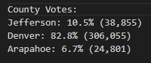
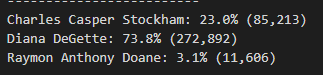
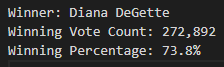

# PyPoll_Challeng

# Overview of Election Audit
- We will be assisting the Colorado board of election to perform a audit for a precinct in Colorado. We will be reporting the total number of votes casted, the total votes for each candidate, and the winner based on the popular vote. Generating this report will allow us to verify the election results for this U.S congressional race. Using Python we are able to automate this process which in turn will be able to be used for not only this precinct it can be used for many others around the U.S. 

# Election-Audit Results

* How many votes were cast in this congressional election?
  There was a total of 369,711 votes casted 

* Provide a breakdown of the number of votes and the percentage of total votes for each county in the precinct.
 Out of the three counties Denver had the largest turnout with 82% of the total votes with a total of 306,055 votes. As you can see Denver had more than the majority of votes    casted versus the other two. Jefferson county had 10% turnout with Arapahoe only having 6.7%. 

* Which county had the largest number of votes?
 Denver received the largest number of votes with a total of 306,055

* Provide a breakdown of the number of votes and the percentage of the total votes each candidate received.
  Among the three candidates Diana Degette had the largest number of votes with 73.8% of the total amount. Charles stocham and Raymon Doane were far behing with a much smaller percentage. Charles received 23% of the votes while Raymon only had 3%. 

* Which candidate won the election, what was their vote count, and what was their percentage of the total votes?
 Diana Degette won the election by a large percentage receiving a total of 272,892 votes and 73% of the total votes casted. 

# Election-Audit Summary
- In summary, I believe that this script will be great use for future election audits allowing us to make minor changes in order to deal with larger data pools and different counties around the United States. This script can be used to perform audits on not only congressional elections but also for presidential elections by making some modifications to the script. Our script is already prepared to receive the total votes per county so by adding in variables for each state and a additional loop to grab the data we can then count the votes for all states in the United States to determine the winner of the presidential election. Adding these modifications will make our script much larger so it will be crucial to have clear and concise notes for readability. Another modification that I believe would be beneficial would be using our script for local elections as well. This would be easy to achieve since our script already collects data and can perform calculations. The only changes that would need to be made for a smaller scale election like this would be to add in variables and for loops for each city in the county. This script is very versatile and can be used in many different elections types with just minor changes. 
